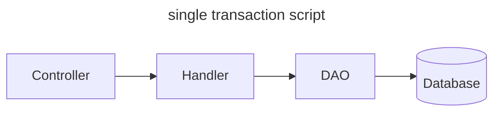
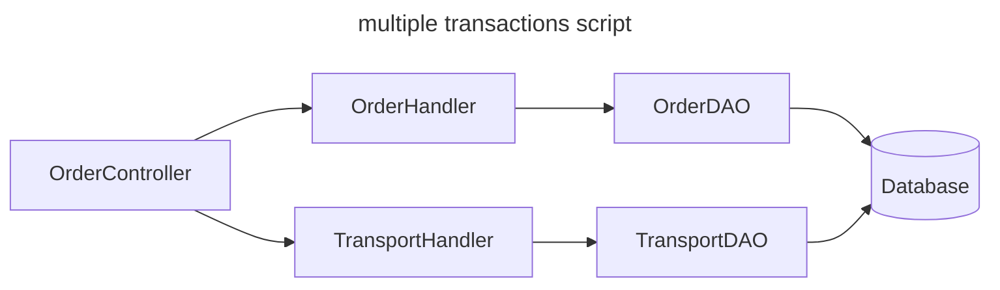
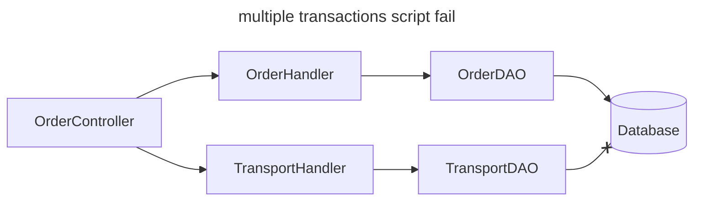

```mermaid
---
title: single transaction script
---

flowchart LR
    Controller --> Handler --> DAO --> db[(Database)]

```
---

```mermaid
---
title: multiple transactions script
---

flowchart LR
    OrderController --> OrderHandler --> OrderDAO --> db[(Database)]
    OrderController --> TransportHandler --> TransportDAO --> db[(Database)]
    
```

---

```mermaid
---
title: multiple transactions script fail
---

flowchart LR
    OrderController --> OrderHandler --> OrderDAO --> db[(Database)]
    OrderController --> TransportHandler --> TransportDAO --x db[(Database)]

```
