# **Clean Architecture and transactional consistency**
## How to manage multiple data model objects in a single request

   
Duc Trinh
duc.trinh@hcl.com

---
# Table of content
1. The problem
2. Clean Architecture & Domain-driven design
3. DDD Aggregate
4. Unit-of-work pattern

---
# 1. The problem

---

# Write single object in a single transaction
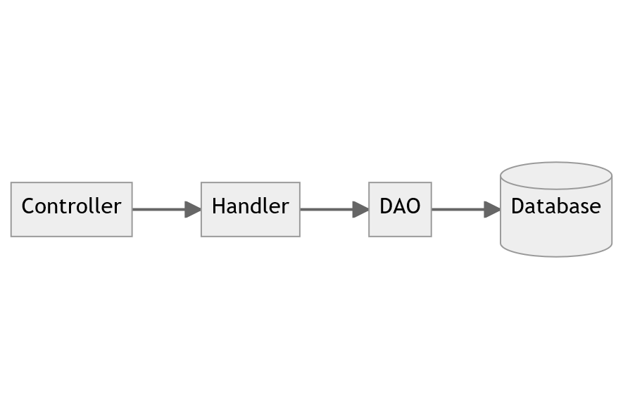

---

# Write multiple objects with multiple transactions
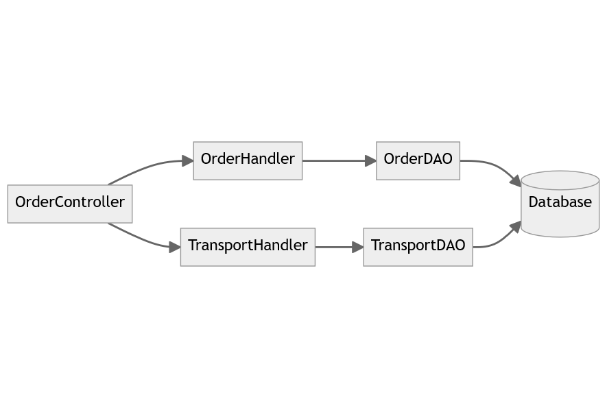

---

# Write multiple objects with multiple transactions

Transport object is not persisted, and violates the business requirement.

---

# 2. Clean Architect & Domain-driven design

---

# Clean Architecture

---

# Domain-driven design (DDD)
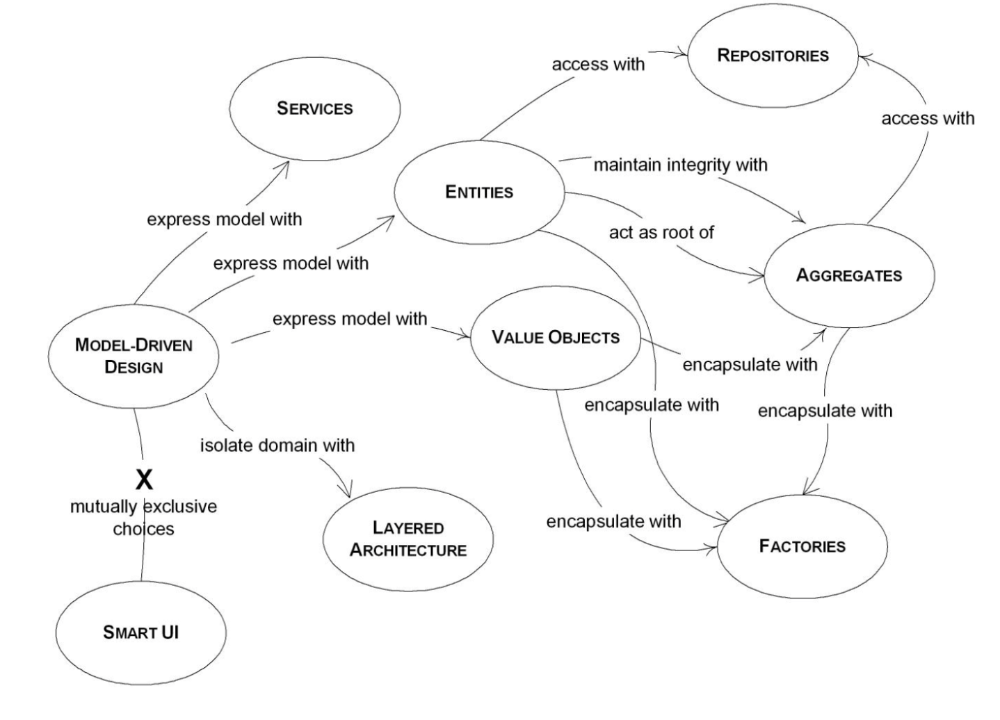

---

# DDD Entity

</img>

---

# DDD Aggregate & Aggregate root

"A DDD aggregate is a cluster of domain objects that can be treated as a single unit. An example may be an order and its line-items, these will be separate objects, but it's useful to treat the order (together with its line items) as a single aggregate.

An aggregate will have one of its component objects be the aggregate root. Any references from outside the aggregate should only go to the aggregate root. The root can thus ensure the integrity of the aggregate as a whole."

[Martin Fowler](https://martinfowler.com/bliki/DDD_Aggregate.html)

---

# DDD Aggregate & Aggregate root
"Those entities that need to be transactionally consistent are what forms an aggregate. Thinking about transaction operations is probably the best way to identify aggregates."

[Microsoft article](https://learn.microsoft.com/en-us/dotnet/architecture/microservices/microservice-ddd-cqrs-patterns/microservice-domain-model#the-aggregate-pattern)

---

# Repository

For each aggregate or aggregate root, you should create one repository class
[Microsoft article](https://learn.microsoft.com/en-us/dotnet/architecture/microservices/microservice-ddd-cqrs-patterns/infrastructure-persistence-layer-design#define-one-repository-per-aggregate)

---

# Repository & Unit-of-work

[Microsoft article](https://learn.microsoft.com/en-us/aspnet/mvc/overview/older-versions/getting-started-with-ef-5-using-mvc-4/implementing-the-repository-and-unit-of-work-patterns-in-an-asp-net-mvc-application#the-repository-and-unit-of-work-patterns)

---

# Code example

---

# Order entity as the Aggregate root
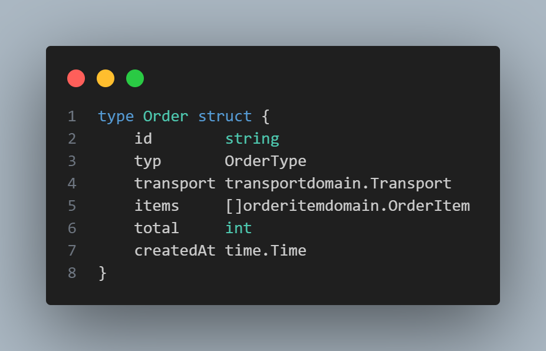

---

# Transport entity
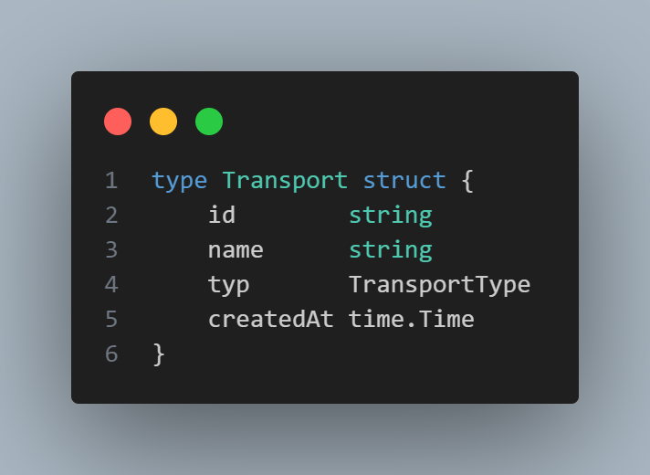

---

# Use case create order
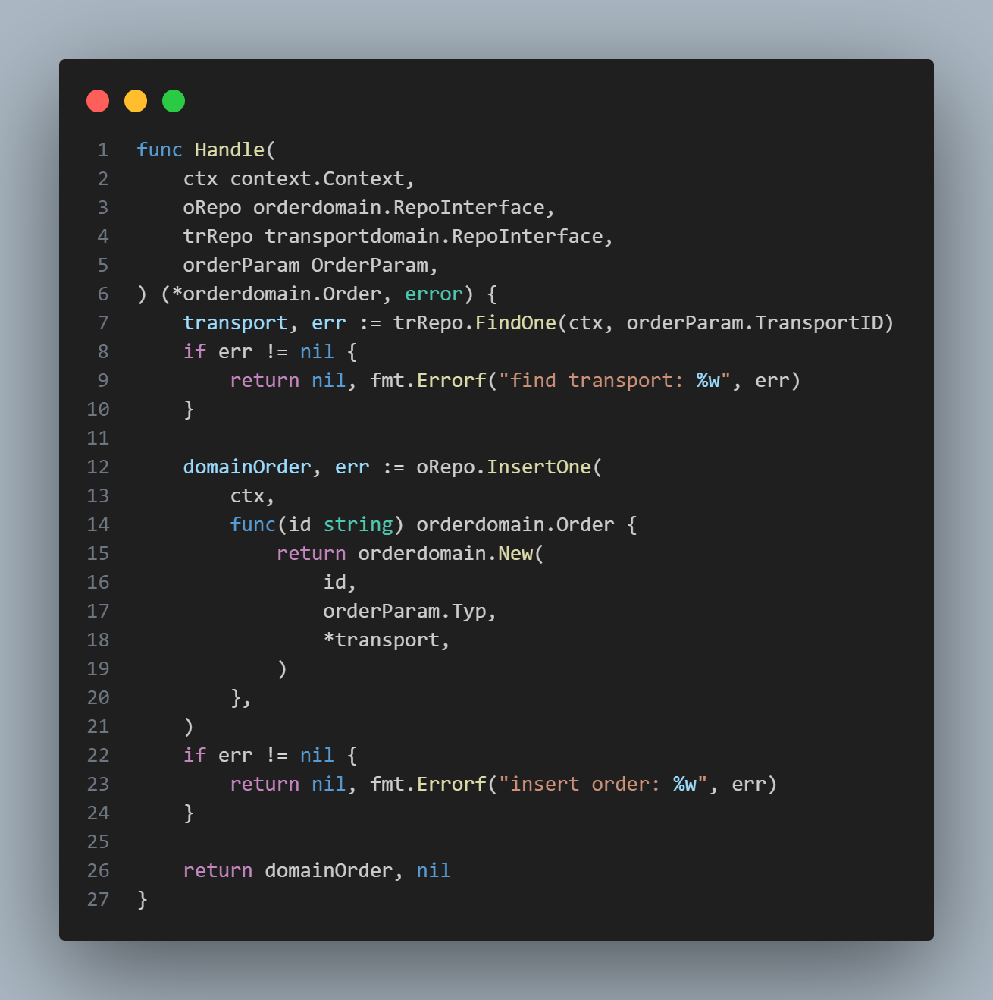

---

# MySQL repository
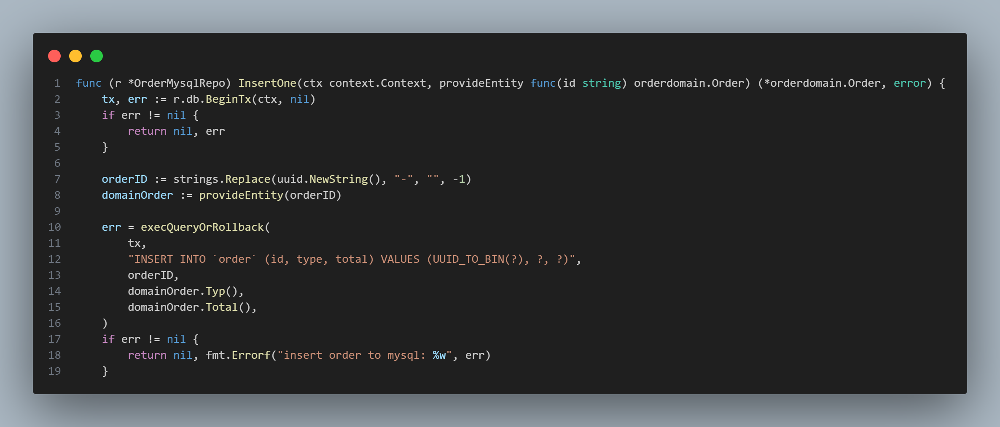

---

# MySQL repository
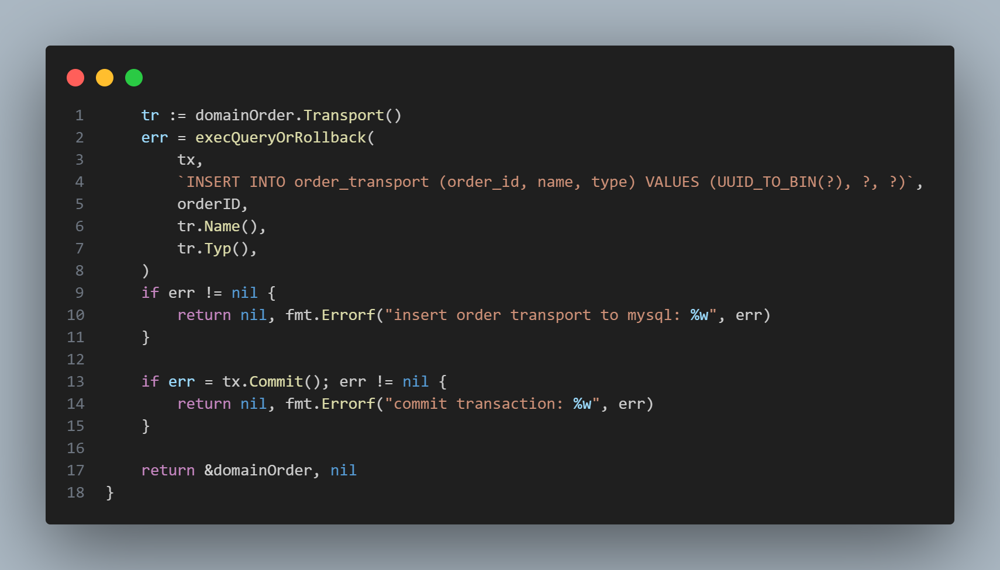

---

# MongoDB repository
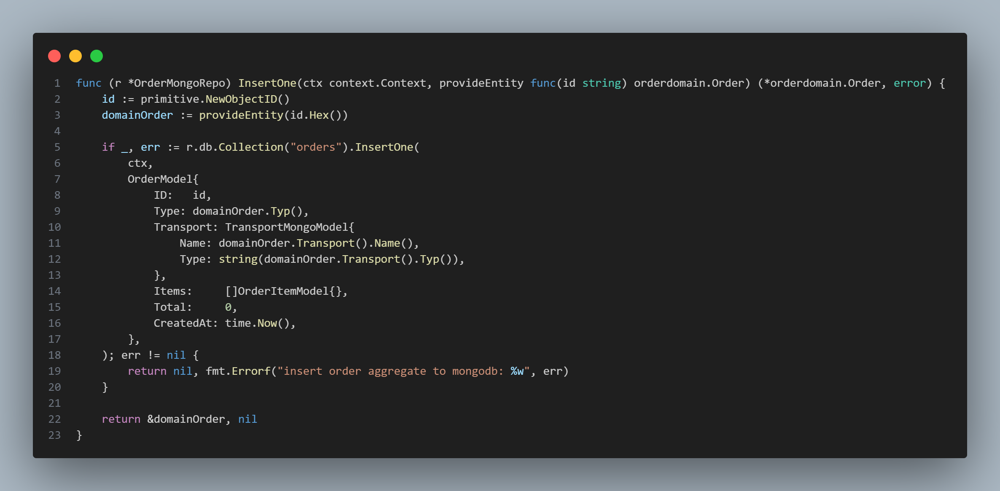

---

# Pros

- Data consistency
- More confident on maintance and develop features without breaking business
- Easy testing

---

# Cons
- Over-engineering
- Complex
- Rely on domain expert

---

# 4. Unit-of-work pattern

---

# Unit-of-work

"A Unit of Work keeps track of everything you do during a business transaction that can affect the database. When you're done, it figures out everything that needs to be done to alter the database as a result of your work."
[Martin Fowler](https://martinfowler.com/eaaCatalog/unitOfWork.html)

---

# Unit-of-work pattern
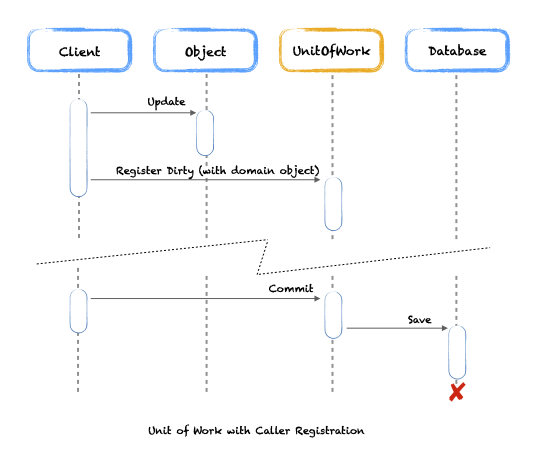

Caller registration

---

# Unit-or-work pattern
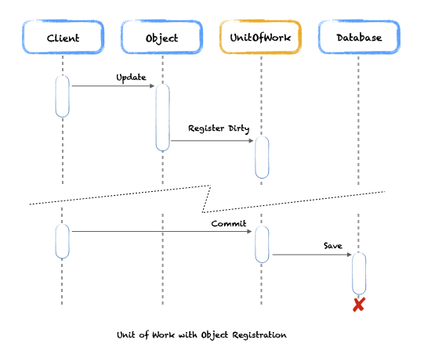

Object registration

---

# Unit-of-work pattern
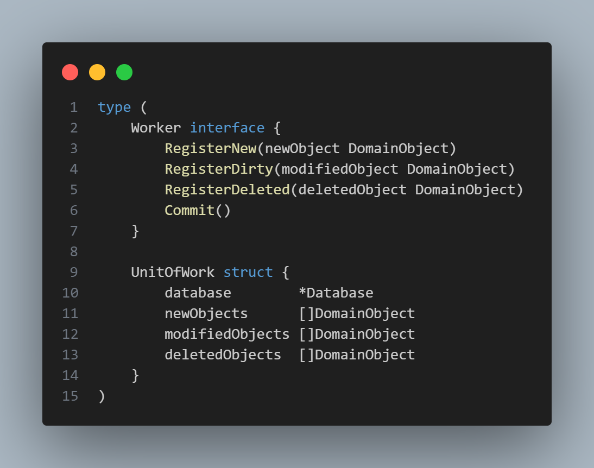

---

# 4. Unit-of-work pattern
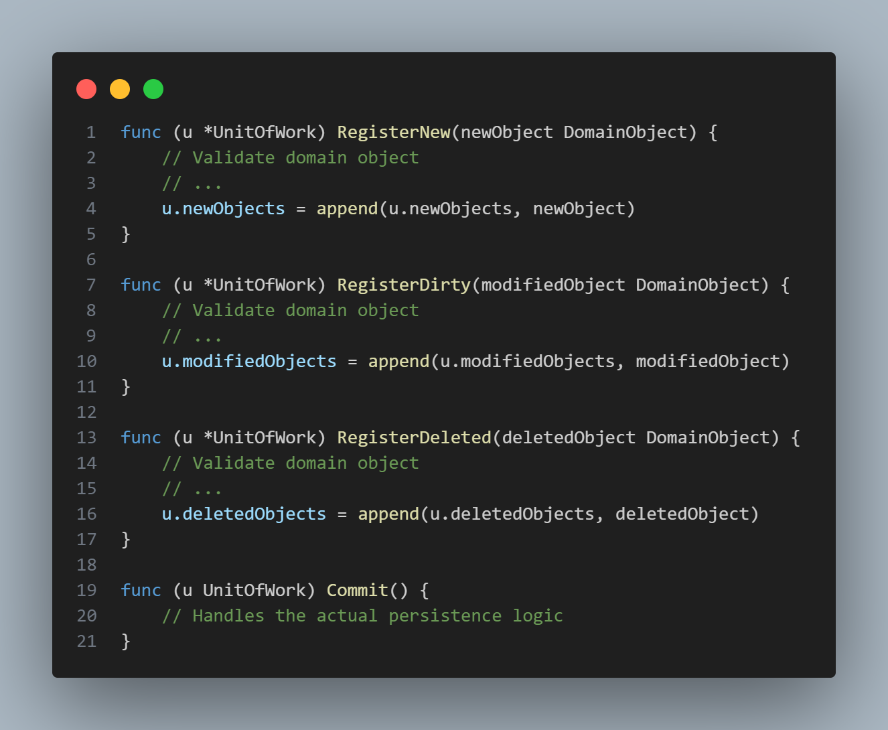

---

# Thank you!